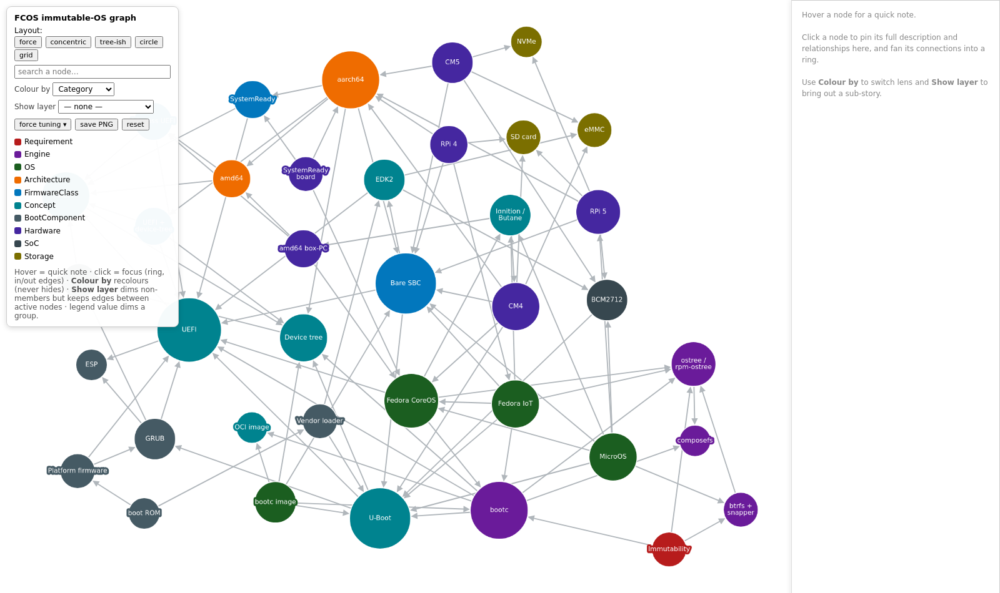
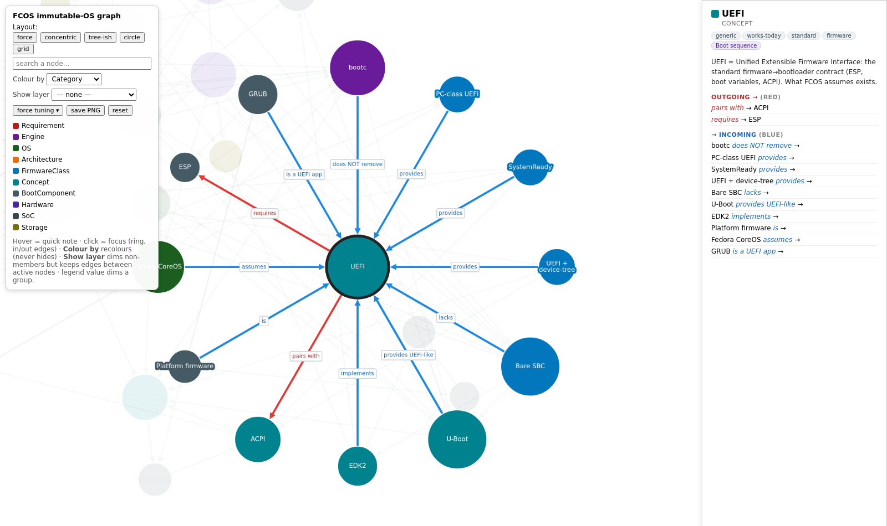
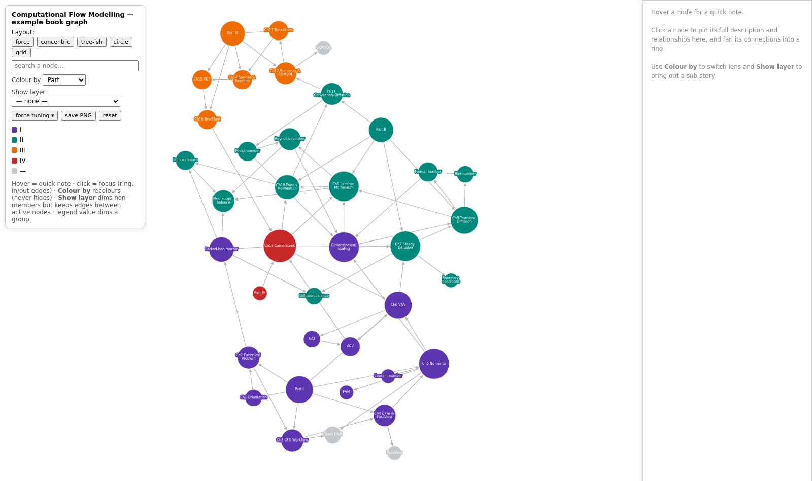
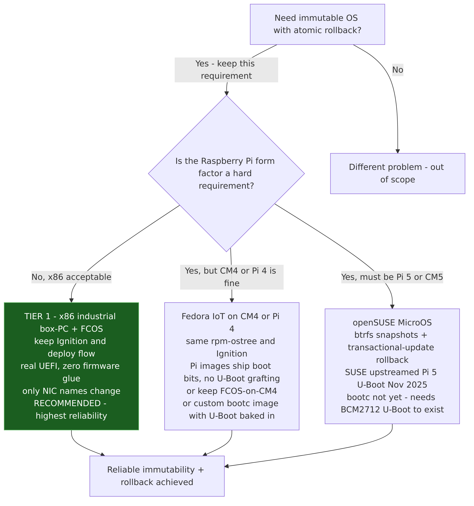

# interactive-knowledge-graph

A small, dependency-light toolkit for building and exploring **interactive
knowledge graphs** of a subject: its concepts, artefacts and claims, and the
relationships among them.

Two parts:

- **A method** (`METHOD.md`) for discovering the categories, facets, layers,
  nodes and edges, so connections are not missed.
- **A renderer** (`src/graph.html`) that draws any dataset as an interactive
  Cytoscape.js graph: hover notes, a details side-panel, colour-by-facet,
  show-layer, directional focus (in/out edges), search, force-tuning and PNG
  export.

The FCOS / immutable-OS graph under `examples/fcos/` is a worked implementation.

## Screenshots

The interactive renderer (`src/graph.html`) on the FCOS example:



Click a node to focus it: its outgoing edges turn red, incoming edges blue, and its
connections fan into a ring, with the description in the side panel.



The same renderer on the example **book** graph (`examples/book/`), coloured by Part:



Static Mermaid diagrams of the same subject (`examples/fcos/diagrams/`, rendered with
`tools/render-mermaid.sh`):



## Live demo

With GitHub Pages enabled for this repository, the interactive graph runs in the
browser without cloning:

- FCOS example: `https://psunthar.github.io/interactive-knowledge-graph/src/graph.html`
- Book example: `https://psunthar.github.io/interactive-knowledge-graph/src/graph.html?data=examples/book/data.js`

## Layout

```
METHOD.md                 the discovery method — start here
src/graph.html            generic interactive renderer (data-driven)
tools/render-mermaid.sh   render *.mmd diagrams to PNG/SVG (podman or mmdc)
examples/fcos/            a worked implementation
  data.js                 the dataset (assigns window.KG = {...})
  README.md               what the FCOS graph models
  mindmap.html            an alternative collapsible markmap view
  mindmap.mm.md           markmap source
  diagrams/*.mmd          static Mermaid diagrams + a reading guide
```

## View it

Open `src/graph.html` in a browser. It loads the FCOS example by default (needs
internet for the Cytoscape CDN). To view a different dataset:

```
src/graph.html?data=<path-to-your-data.js>
```

## Build your own graph

1. Follow `METHOD.md`, Steps 0 to 7.
2. Copy `examples/fcos/data.js` to `examples/<topic>/data.js` and replace the
   contents.
3. Validate the structure: `node tools/validate.mjs examples/<topic>/data.js`.
4. Open `src/graph.html?data=examples/<topic>/data.js`.

## Validate a dataset

`tools/validate.mjs` (Node.js, no dependencies) checks a dataset for structural
faults that a renderer would otherwise hit at load time or ignore: a node whose
category is undeclared, an edge whose endpoint is not a node, a facet value outside
its allowed set, duplicate ids, orphan nodes. The dataset shape is documented in
`schema/kg.schema.json`.

```
node tools/validate.mjs examples/fcos/data.js
```

This finds broken structure; it does not find missing domain edges. For that, use
the exhaustive pairwise sweep in `METHOD.md` (Step 5).

## Data model

A dataset assigns `window.KG`:

- `title` — heading shown in the control panel.
- `groups` — `{ Category: '#colour' }`, the primary-category palette.
- `facets` — `{ facet: { name, values: { value: '#colour' } } }`, the extra
  colour-by perspectives.
- `layers` — `{ layerId: { name, color } }`, the highlightable subgraphs.
- `nodes` — `[{ id, label, group, short, desc, facets: {...}, layers: [...] }]`.
- `edges` — `[{ source, target, label }]`, directed.

## Provenance

This began as a set of diagrams for one technical topic and was extracted here so
the tool and the method are reusable across topics. See `examples/fcos/README.md`.
