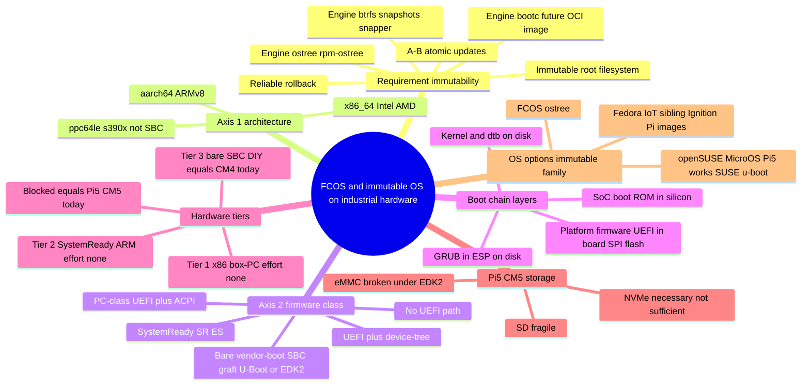
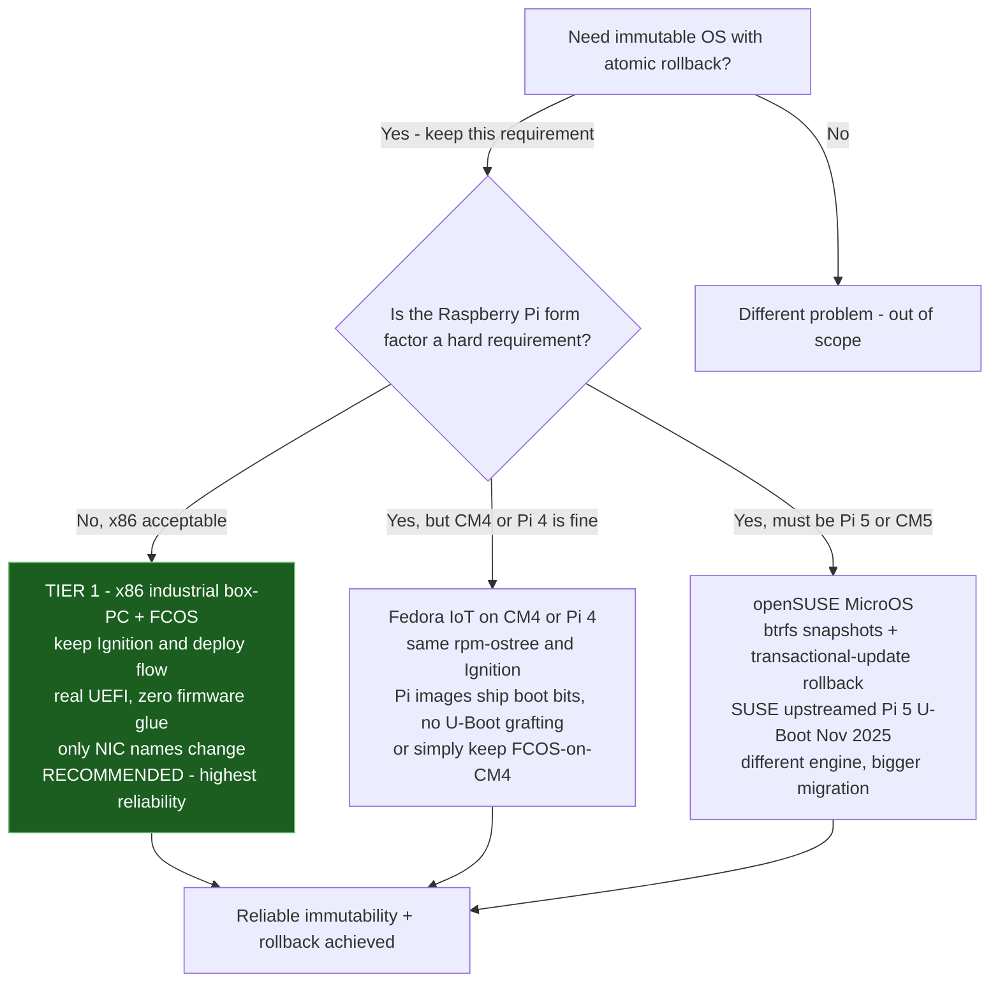
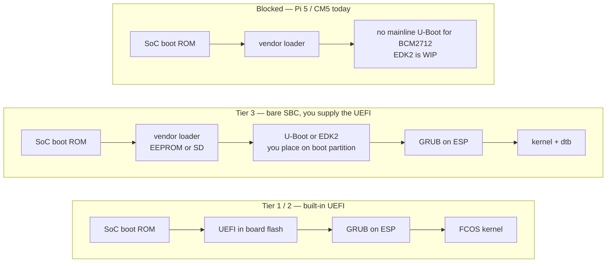

# FCOS / immutable-OS on industrial hardware — concept & decision map

Two views of the same problem:
- **Concept map** — the ideas and how they relate (what UEFI is, the two axes, tiers).
- **Decision flowchart** — the actual choose-your-hardware path.

Preview: VS Code Mermaid extension, GitHub, or <https://mermaid.live>.

---

## 1. Concept map

---

## 2. Decision flowchart

---

## 3. Boot chain (why the tiers differ)

